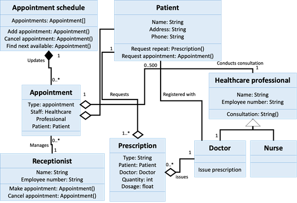
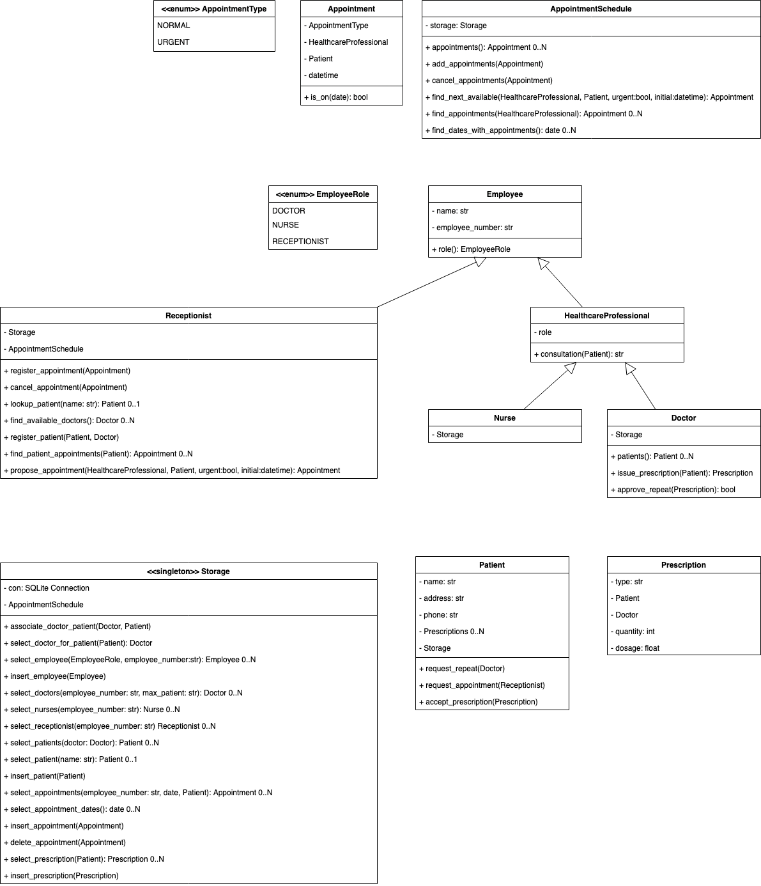
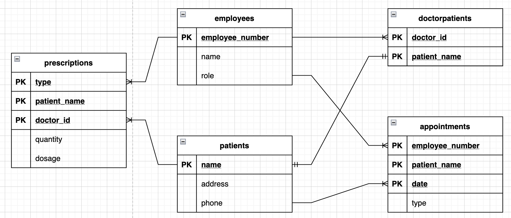

# 🚑 Healthcare

End module assignment for *Object-oriented Information Systems November 2021*

## how to use it

setup with

```
pip3 install -e .
```

run the tests with

```
python3 setup.py test
```

start it with

```
python3 main.py
```

## Design

original design



actual design




